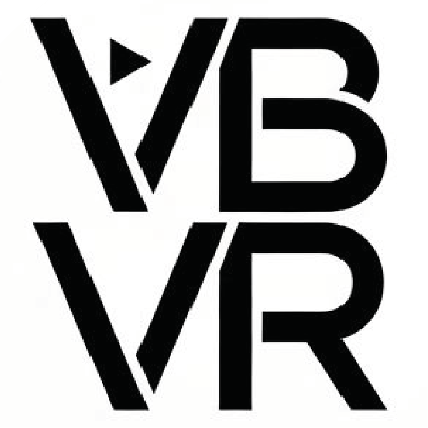

<h1 align="center">VBVR-EvalKit</h1>

<p align="center">
  <b>The official evaluation toolkit for <a href="https://video-reason.com/">Very Big Video Reasoning (VBVR)</a></b><br>
  Unified inference and evaluation across 37 video generation models.
</p>

- **37 Models**: Commercial APIs (Luma, Veo, Kling, Sora, Runway) + open-source (LTX-Video, LTX-2, HunyuanVideo, SVD, WAN, CogVideoX, etc.)
- **VBVR-Bench**: 100+ rule-based evaluators, deterministic 0-1 scores, no API calls
- **Coming Soon**: Human evaluation (Gradio) and VLM-as-a-Judge (GPT-4O, InternVL, Qwen3-VL)

## Quick Start

```bash
# Install
git clone https://github.com/Video-Reason/VBVR-EvalKit.git && cd VBVR-EvalKit
python -m venv venv && source venv/bin/activate
pip install -e .

# Setup a model
bash setup/install_model.sh --model svd --validate

# Inference
python examples/generate_videos.py --questions-dir setup/test_assets/ --output-dir ./outputs --model svd

# Evaluation (VBVR-Bench)
python examples/score_videos.py --inference-dir ./outputs
```

## Evaluation

VBVR-Bench matches each task to a rule-based evaluator by the **generator name** in the directory path. The evaluator needs both the generated video and reference data side by side:

```
{model}/{generator_name}/{task_type}/{task_id}/{run_id}/
    ├── video/output.mp4          # generated video
    └── question/                 # reference data
        ├── first_frame.png
        ├── final_frame.png
        ├── prompt.txt
        └── ground_truth.mp4     # optional
```

```bash
python examples/score_videos.py --inference-dir ./outputs           # task_specific score only
python examples/score_videos.py --inference-dir ./outputs --full-score  # all 5 dimensions
```

See [docs/En/SCORING.md](docs/En/SCORING.md) for the full end-to-end workflow, scoring dimensions, output format, and CLI reference.

## API Keys (Inference Only)

```bash
cp env.template .env
# LUMA_API_KEY=... OPENAI_API_KEY=... GEMINI_API_KEY=... KLING_API_KEY=... RUNWAYML_API_SECRET=...
```

## Docs

- [Scoring (VBVR-Bench)](docs/SCORING.md)
- [Inference](docs/INFERENCE.md)
- [Supported Models](docs/MODELS.md)
- [Adding Models](docs/ADDING_MODELS.md)
- [End-to-End Workflow](docs/DATA_GENERATOR.md)
- [FAQ](docs/FAQ.md)

## License

Apache 2.0

<p align="center">
  
</p>
